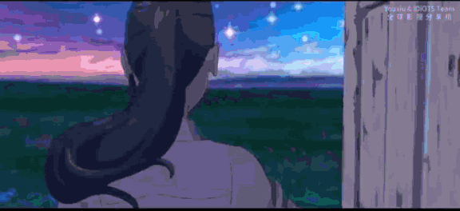

  

# ⚡ Hi there, I'm Quốc Phú! 👋

  

  <strong>Software Engineer | Web Developer | Mobile App Developer</strong>

  
  
  
  

---

## 🚀 About Me

I am a passionate **Software Engineer** specializing in **Web & Mobile App Development**. I love building clean, responsive, and high-performance digital solutions that solve real-world problems. With a solid foundation in both frontend design and backend architecture, I'm always eager to explore new technologies and adopt best development practices.

- 🎓 **My Goal:** To design and develop scalable, robust software systems while ensuring an exceptional, smooth user experience.
- 🔭 **What I'm Working On:** Developing modern web platforms using **Next.js** / **Laravel** and crafting native-like mobile applications with **React Native** / **Kotlin**.
- 🌱 **What I'm Exploring:** Deep diving into cloud computing (**AWS**), containerized development (**Docker**), microservices, and database tuning.
- 💬 **Ask me about:** PHP/Laravel, React Native, Next.js, Java, Kotlin, SQL databases, and Clean Code principles.
- ⚡ **Fun fact & Philosophy:** I believe that coding is an art. A good program is not only functional but also readable, maintainable, and aesthetically satisfying. When I'm not writing code, I enjoy designing UI interfaces in Canva and researching system architectures.

---

## 💻 Tech Stack & Tools

<table border="0" width="100%">
  <tr>
    <td valign="top" width="50%">
      <h3>🌐 Frontend Development</h3>
      
    </td>
    <td valign="top" width="50%">
      <h3>⚙️ Backend & Databases</h3>
      
    </td>
  </tr>
  <tr>
    <td valign="top" colspan="2" style="padding-top: 15px;">
      <h3>🛠️ DevOps, Tools & Utilities</h3>
      
    </td>
  </tr>
</table>

---

## 📊 GitHub Stats & Activity

<table border="0" align="center" width="100%">
  <tr>
    <td align="center" width="50%">
      
    </td>
    <td align="center" width="50%">
      
    </td>
  </tr>
  <tr>
    <td align="center" colspan="2" style="padding-top: 15px;">
      
    </td>
  </tr>
</table>

---

## 🏆 GitHub Trophies

  
✨ <strong>Click to expand / collapse trophies list</strong>

   
  

    
  

 

  

